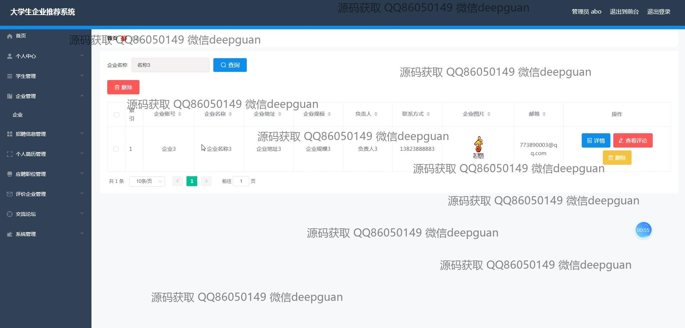

<h1 align="center">的大学生企业推荐系统vue</h1>

## 简介
大学生企业推荐系统：角色分为学生和企业用户；功能包括个人信息管理、企业管理、招聘信息管理、简历管理、企业评价、推荐企业展示、交流论坛。    --计算机毕业设计源码；毕设源码；java毕业设计源码

## 联系方式

<h3 align="center">获取完整代码与数据库文件 + 微信：deepguan QQ: 86050149 QQ群: 783742310</h3>

<h3 align="center">可帮忙远程部署 包运行成功！提供远程部署、修改代码、设计文档指导、代码讲解等服务！</h3>

## 功能介绍（完整见运行截图）
管理员：登录和注册功能，包括为新用户创建账号的选项。具有全面的企业和学生管理功能，能够管理招聘信息、简历信息、职位应聘和企业评价等。提供密码修改、企业及用户信息的维护和更新功能，以及系统后台管理模块。可在企业列表中进行搜索和详细信息的查看与删除管理操作。

学生用户：基本功能包括登录和注册，支持选择学生身份。可以访问和更新个人信息，如学号、姓名、联系方式和简历等。可查看和管理个人中心信息，包括个人简历的填写与编辑、求职职位的管理和企业评价的提交。提供搜索工具以快速查找合适的职位或企业。支持简历信息的查看、教育背景和工作经验的录入与管理。

企业用户：登录和注册功能，支持以企业身份访问。可更新和编辑企业信息，包括企业名称、地址、规模、联系方式等。提供招聘信息发布和管理的功能，包括职位要求、上班时间及薪资待遇的填写。可查看和管理企业中心数据、更新公司信息，并在平台上与学生信息进行对接。

普通用户：能进行访问网站首页及基本导航功能，能够通过主导航栏访问招聘信息、个人简历、交流论坛及个性化企业推荐功能。支持背景切换及主页面互动操作，如查看招聘列表、公司推荐信息以及快速访问个人中心和后台管理模块。

## 运行截图

本代码来源于网络,仅供学习参考使用!

